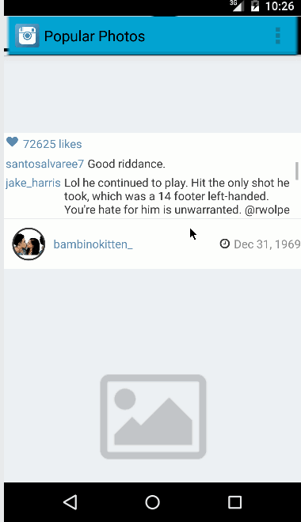

# Instagram Popular Feed Viewer

This is an Android application for displaying the most popular Instagram photos feed  using the [Instagram popular photo API](https://api.instagram.com/v1/media/popular?client_id=ed472c3cea474aaaa6c1cd6b6c7b1ba3). 

Time spent: 10 hour or so.

Completed user stories:

 * [x] Required: User can scroll through current popular photos from instagram 
 * [x] Required: For each photo displayed, user can see the following details:
                 Graphic, Username (I left out caption since that's what instagram does)
                 (Optional) relative timestamp, like count, user profile image 
 * [x] Optional: Add pull-to-refresh for popular stream 
 * [x] Advanced: Show latest comment for each photo (bonus: show last 2 comments)
 * [x] Advanced: Display each photo with the same style and proportions as the real Instagram
 * [x] Additional: Customize actionbar theme
 * [x] Advanced: Display each user profile image using a RoundedImageView
 * [x] Advanced: Display a nice default placeholder graphic for each image (photo & avatar)  during loading
 * [x] Advanced: Improve the user interface through styling and coloring
 * [ ] TODO: Allow user to view all comments for an image within a separate screen or a dialog fragment
 
Walkthrough of all user stories:

